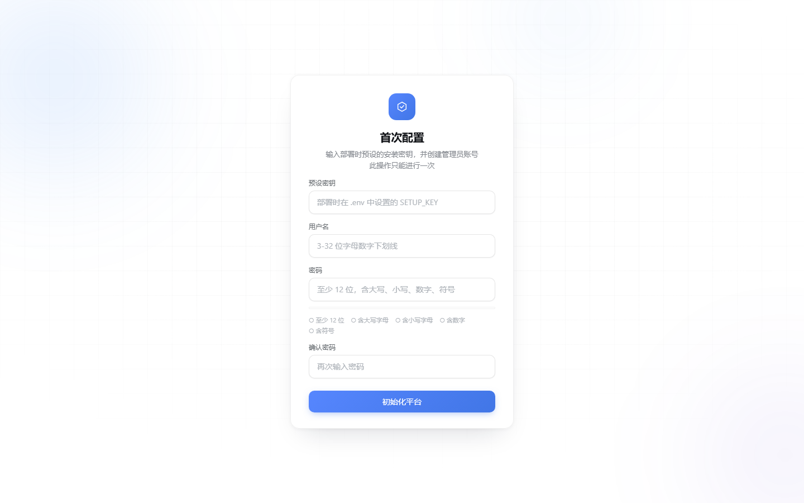
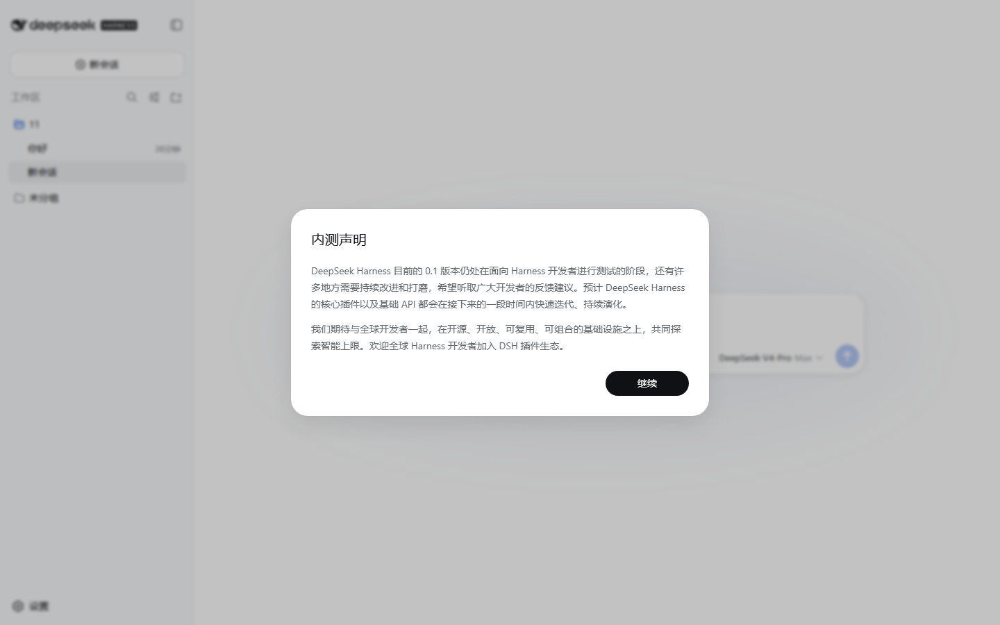

# dsh-passwords

A **password gate** for DeepSeek Harness (dsh): safe **remote access** plus **multi-user** accounts.

dsh's built-in web UI has no login at all. Put it on a server or cloud host and anyone with the address can use it — and burn your API key. dsh-passwords puts a login page in front of dsh: everyone sees the login page first, and only correct credentials get through.

> **One-liner: dsh-passwords = dsh's remote-access front door + a multi-user account system.** You don't need it for purely local use; but if the access URL isn't localhost, install it first.

🏅 Listed in the [Awesome DeepSeek Harness](https://github.com/0xsline/awesome-deepseek-harness) ecosystem index (Infrastructure & Development) and the [Awesome DSH Plugin](https://github.com/awesome-dsh-plugin/awesome-dsh-plugin) list (Development & Runtime).

## Two core capabilities

### 1️⃣ Remote access

- Login page + first-time setup page (on first visit you create the owner account; afterwards everyone goes through the login page)
- One login lasts 12 hours (cookie session, survives browser restarts)
- HTTPS support with automatic 80-port redirect (strongly recommended for public deployments)
- The login page follows dsh's theme automatically (dark when dsh is dark)
- Remote browsers can use every dsh settings feature (dsh by default only lets local browsers edit settings; dsh-passwords handles this automatically — and if the settings page breaks after a dsh upgrade, the in-settings card has a one-click "Reload patch" fix)

### 2️⃣ Multi-user

- One **owner** (created at first-time setup) + any number of **subusers**, each with their own login
- All account management happens in a card on dsh's settings page — no SSH needed: change passwords, change usernames, create/delete subusers
- The owner manages all subusers; subusers can only change themselves
- Changing a password immediately invalidates all old sessions; every login and failure is logged — one command shows who signed in when

## Screenshots

| Login page (light · follows system) | Login page (dark · follows dsh theme) |
|---|---|
|  |  |

| First-time setup page (first visit) | dsh main UI (after login) |
|---|---|
|  |  |

## Try it locally first

Requires Node.js **22.5 or newer** (`node -v` to check).

```bash
npm install           # install dependencies
cp .env.example .env  # copy the config template
npm run build         # build
npm start             # start, then open http://localhost:8080
```

Change `SETUP_KEY` in `.env` before starting (explained below).

## What is SETUP_KEY, and where is it?

`SETUP_KEY` is the **setup key**. The first time the web page opens it shows the "First-time setup" page and asks for this key — only after entering it correctly can you create the owner account. Its job is to stop a stranger from initializing your platform before you do.

**It lives in the `.env` file at the project root**, on this line:

```ini
SETUP_KEY=change-me-to-a-strong-random-key
```

Steps:

1. Open `.env` and find the `SETUP_KEY=` line
2. Replace the value with your own random string:
   ```bash
   openssl rand -hex 24   # run on Linux/macOS, prints a random string
   ```
3. Save it and restart the gateway
4. Open the web page and paste that string into the "Setup key" field

⚠ If you don't change it to a random value the gateway refuses to start. After initialization the key is no longer used — login only accepts username + password from then on.

## Deploying to a server (copy-paste guide)

### 1. Install Node.js 22+

```bash
curl -fsSL https://deb.nodesource.com/setup_22.x | sudo -E bash -
sudo apt-get install -y nodejs
node -v   # confirm >= v22.5.0
```

### 2. Install dsh and prepare an API key

```bash
npm install -g @deepseek-ai/dsh
```

Get an API key from the DeepSeek platform (starts with `sk-`); you'll need it shortly.

### 3. Download this project

```bash
cd /opt
git clone https://github.com/slywalker2006/dsh-passwords.git
cd dsh-passwords
npm install
cp .env.example .env
```

Open `.env` and change three things:

| What | Change to |
|---|---|
| `SETUP_KEY=...` | required — generate with `openssl rand -hex 24` |
| `MCP_GATEWAY_PORT=8080` | the port you want to expose publicly, e.g. `80` |
| `MCP_DB_ENC_KEY=` | fill in a value from `openssl rand -hex 32` (data-encryption key; **once set it can't be changed**) |

```bash
npm run build
```

### 3.5 Register dsh-passwords as a dsh plugin (the settings card)

dsh's settings-page plugin list is driven by the profile's dependencies; add this project:

```bash
cd ~/.dsh/profiles/web
pnpm add /opt/dsh-passwords
```

(dsh rc.6 manages profile dependencies with pnpm; if pnpm is missing, run `npm install -g pnpm@9` first.)

Now dsh loads the dsh-passwords host plugin at startup: a "dsh-passwords · Password Gate" card appears on the settings page with all account management inside.

### 4. Run both processes under systemd (auto-start on reboot)

The dsh service (`/etc/systemd/system/dsh-web.service`):

```ini
[Unit]
Description=DeepSeek Harness web
After=network.target

[Service]
Type=simple
Environment=DEEPSEEK_API_KEY=sk-your-key
Environment=DSH_PASSWORDS_ENV_FILE=/opt/dsh-passwords/.env
ExecStart=/usr/local/bin/dsh web --patch /opt/dsh-passwords/cordis.yml
Restart=on-failure
RestartSec=5

[Install]
WantedBy=multi-user.target
```

> `DSH_PASSWORDS_ENV_FILE` makes the in-dsh plugin read the same `.env` as the gateway (same database, same keys) — it must be set.

The gateway service (`/etc/systemd/system/dsh-gateway.service`):

```ini
[Unit]
Description=dsh-passwords login gateway
After=network.target

[Service]
Type=simple
WorkingDirectory=/opt/dsh-passwords
ExecStart=/usr/local/bin/node dist/cli.js serve-gateway
Restart=on-failure
RestartSec=5

[Install]
WantedBy=multi-user.target
```

```bash
sudo systemctl daemon-reload
sudo systemctl enable --now dsh-web dsh-gateway
sudo systemctl status dsh-web dsh-gateway   # both should be active
```

### 5. Open the firewall

```bash
sudo ufw allow 80/tcp
```

⚠ On cloud servers (Aliyun/Tencent Cloud etc.) you must also open the same port in the **console security group** — configuring ufw alone does nothing.

### 6. Finish first-time setup in the browser

Visit `http://your-server-ip` → enter the `SETUP_KEY` from `.env` → create the owner account. From now on everyone goes through the login page.

### 7. Strongly recommended: enable HTTPS

Over plain HTTP, passwords can be sniffed by a man-in-the-middle. Three steps to HTTPS:

```bash
cd /opt/dsh-passwords

# 1) Self-signed certificate (use EC elliptic curves, NOT RSA! RSA handshakes can
#    take over a second on weak-CPU servers while EC takes milliseconds;
#    replace with your server IP; use Let's Encrypt if you have a domain)
openssl req -x509 -newkey ec -pkeyopt ec_paramgen_curve:prime256v1 -keyout tls.key -out tls.crt \
  -days 825 -nodes -subj "/CN=your-ip" -addext "subjectAltName=IP:your-ip"
chmod 600 tls.key

# 2) In .env, change to:
#   MCP_GATEWAY_PORT=443
#   MCP_GATEWAY_TLS_CERT=/opt/dsh-passwords/tls.crt
#   MCP_GATEWAY_TLS_KEY=/opt/dsh-passwords/tls.key
#   MCP_GATEWAY_REDIRECT_PORT=80

# 3) Restart and open 443
sudo systemctl restart dsh-gateway
sudo ufw allow 443/tcp   # open 443 in the security group too
```

Afterwards `http://` automatically redirects to `https://`. With a self-signed certificate the browser warns once — click "continue" and you're in.

## How dsh must be started (important)

dsh and the gateway are **two separate processes** — both must run. The dsh start command:

```bash
DEEPSEEK_API_KEY=sk-your-key dsh web --patch /opt/dsh-passwords/cordis.yml
```

What the two arguments do:

- `DEEPSEEK_API_KEY=...`: **required**. The API key dsh uses for the model.
- `--patch .../cordis.yml`: **strongly recommended for remote access**. Without it, clicking "Add workspace" in the web UI tries to open the **local machine's** system folder picker — but you're accessing the server remotely, so the browser can't pop up a local picker, and the click appears dead or errors (`pickDirectory` failure). With this argument, "Add workspace" opens an **in-page server directory browser** instead — browse and pick folders directly on the server (or type an absolute path like `/opt/myapp`).

To avoid typing the arguments every time: merge the contents of `cordis.yml` into `~/.dsh/profiles/web/cordis.patch.yml`, then plain `dsh web` works permanently.

> The systemd config in step 4 already includes `--patch`, so if you followed the guide you can skip this section.

## The password-gate card on the settings page

After signing in to dsh, open **Settings → Plugins** and you'll see the "dsh-passwords · Password Gate" card. Inside:

| Feature | Who can use it | Notes |
|---|---|---|
| **Remote settings + reload patch** | every signed-in user | Shows whether remote settings work; if the settings page breaks after a dsh upgrade, click "Reload patch" for a one-click fix (restarts the web service and refreshes the page — no SSH) |
| **Change password** | yourself; the owner can change anyone's | changing a password immediately invalidates old sessions — sign in again |
| **Change username** | yourself; the owner can change anyone's | after renaming, sign in with the new username |
| **Subuser management** | owner only | create/delete subusers (subusers can sign in through the login page but have no management permissions) |

Notes:

- **Owner** = the account created at first-time setup; everything added later is a **subuser**.
- Account management in the card goes through the gateway's own API, independent of dsh's settings.
- Password requirements match the login page: at least 12 characters including uppercase, lowercase, digits and symbols.

> dsh by default only allows local browsers to edit settings. dsh-passwords handles this automatically so remote browsers signed in through the password gate can use every settings feature. If the settings page breaks after a dsh upgrade, click "Reload patch" in the card (the gateway also re-applies the patch automatically on every gateway start — restarting the gateway works too).

## Configuration reference

| Variable | Default | What it does |
|---|---|---|
| `SETUP_KEY` | required | setup key for first-time configuration (in `.env`) |
| `MCP_DB_PATH` | `./data/platform.db` | where the database file lives (auto-created, no MySQL needed) |
| `MCP_DB_ENC_KEY` | empty | data-encryption key. Generate with `openssl rand -hex 32`. **Once set it can't be changed — changing it makes all old data unreadable** |
| `MCP_GATEWAY_HOST` | `0.0.0.0` | gateway listen address |
| `MCP_GATEWAY_PORT` | `8080` | gateway port |
| `MCP_GATEWAY_UPSTREAM` | `http://127.0.0.1:3080` | dsh web address (leave as default) |
| `MCP_GATEWAY_TLS_CERT` / `MCP_GATEWAY_TLS_KEY` | empty | fill both to enable HTTPS |
| `MCP_GATEWAY_REDIRECT_PORT` | empty | set `80` to make port 80 redirect-only |
| `MCP_GATEWAY_PUBLIC_HOST` | empty | fixed public IP/domain for redirects (prevents Host-header reflection) |
| `MCP_DSH_SETTINGS_FILE` | auto-detected `~/.dsh/settings.yaml` | only needed when the gateway and dsh run on different machines |
| `DSH_PASSWORDS_ENV_FILE` | empty | path for the dsh process to read the gateway's `.env` (systemd: `/opt/dsh-passwords/.env`) |
| `MCP_DSH_ROOT` | auto-detected | dsh install directory (where `@deepseek-ai/dsh` lives); set manually if detection fails |
| `MCP_DSH_RESTART_SERVICE` | `dsh-web` | the dsh systemd service restarted after a patch reload; empty = no auto-restart |
| `MCP_INTERNAL_SECRET` | derived from SETUP_KEY | gateway internal-API secret (the dsh plugin → gateway notify channel); normally leave as is |

## Common commands

```bash
npm start                              # start the gateway
node dist/cli.js audit --limit 20    # last 20 audit-log entries (auto-decrypted)
node dist/cli.js serve-gateway --port 9000   # start on a different port
node dist/cli.js patch status        # show remote-settings patch status
node dist/cli.js patch               # reload the patch (re-apply + restart dsh-web)
```

## FAQ

- **The login page keeps showing "First-time setup"?** The user table is empty (fresh database, or it was wiped). Enter the `SETUP_KEY` per the page prompt and create the owner account again.
- **Forgot the owner password?** Stop the service, run `node -e "const {DatabaseSync}=require('node:sqlite');const db=new DatabaseSync('data/platform.db');db.exec('DELETE FROM users;')"`, restart and go through first-time setup again.
- **dsh reports `crypto.randomUUID is not a function`?** Old gateway builds didn't have the HTML-injection compat layer — update the code and **hard-refresh the browser** (Ctrl+Shift+R).
- **Is it a problem if the database file gets stolen?** No. Sensitive fields are ciphertext or hashes; without the keys in `.env` they can't be decrypted. Passwords are bcrypt hashes only — there was never any plaintext.
- **Want to change `MCP_DB_ENC_KEY`?** You can't. Once enabled, this key can't be changed — a new key makes all historical data unreadable. When backing up the database, back up `.env` together with it.
- **Access feels slow?** The gateway itself only spends ~1-2ms per request. Check the TLS handshake first: `curl -sk -o /dev/null -w "TCP:%{time_connect}s TLS:%{time_appconnect}s\n" https://your-ip/gateway/login` — if the TLS number is hundreds of ms, you're probably using an RSA certificate (RSA handshake signing is very slow on weak-CPU servers); switch to an EC certificate (see step 7). If TCP and TLS are both fast but it's still slow, it's your network/proxy path to the server — code can't fix that.
- **Stuck on "Loading plugins…" every time?** That's dsh loading its ~30 plugin scripts — dsh returns `no-cache` for plugin/static assets, so the browser re-downloads everything every visit. Since v2.0.4 the gateway forces one-year immutable caching on `/assets/*` and `/plugins/*` URLs with `rev=` (filenames/rev are content hashes, so dsh updates get new URLs automatically). After upgrading, the **first** visit still downloads everything once; later refreshes are instant. If it's still slow after an upgrade, hard-refresh once (Ctrl+Shift+R) so the new response headers take effect.
- **npm fails installing dsh (allow-scripts / node-pty)?** Run `npm config set allow-scripts=... --location=user` and install `sudo apt install build-essential` (this project itself has no such issue — it's dsh's dependencies that need compiling).

## Security & privacy

Account passwords are stored as bcrypt hashes only; usernames, IPs and audit records are encrypted at rest; 5 consecutive wrong passwords lock the account for 15 minutes. All keys live in your own `.env` and database — the source being public does not affect security.

## Language

The UI is bilingual (简体中文 / English) and follows dsh's language setting:

- **Login / setup pages**: follow dsh's language (Settings → General → Language), falling back to the browser language; a 中文/English switch in the top-right corner of the page overrides it.
- **Settings-page card**: follows dsh's language setting and updates immediately when you switch it.
- **CLI**: follows the `LANG` / `LC_ALL` environment variable (`en` prefix = English).

## License

[BSD 3-Clause](./LICENSE) © 2026 slywalker2006 — free to use, modify and distribute; keep the copyright notice.

This project is an independent dsh extension and is not affiliated with DeepSeek. dsh itself is licensed under its own license (MIT).
